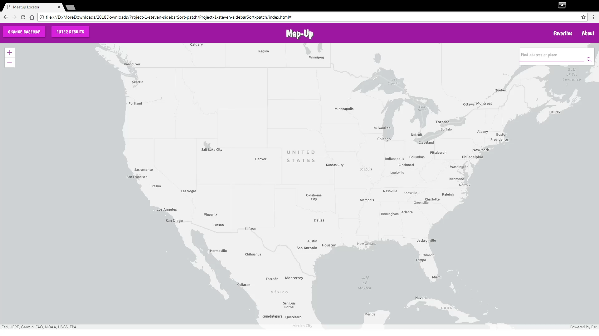

# Map-Up

The application uses the location data of upcoming events from Meetup.com and plots the coordinates on a map displaying where the events will take place. Once the points are plotted, the user can click on a point and a pop up will display the event information such as the event title, meetup group, date and time of event, and the RSVP Tally or Waitlist Tally. The application allows for the user to filter the results by date and subject. The user can also save the event for future reference. The user can click on an attached link in the popup or sidebar to navigate to the events page on Meetup.com.

Demo Video:

### Prerequisites

Any text editor.

Team used Visual Studio Code.

## Built With

* [Meetup API] (https://www.meetup.com/meetup_api/) - The main dataset
* [ArcGIS API] (https://developers.arcgis.com/javascript/) - The mapping API
* [Materlialize] (https://materializecss.com/about.html) - The CSS Framework used

## Authors 
* **Jacob Nelson** - *Initial Work* - [jrnels10]
(https://github.com/jrnels10)

* **Andrew Vasquez** - *Initial Work* - [Xeroneon]
(https://github.com/xeroneon)

* **Paulo Alzaga** - *Initial Work* - [PbaAZphx18]
(https://github.com/PbaAZphx18)

* **Steven Passey** - *Initial Work* - [stevenpassey]
(https://github.com/stevenpassey)

##License 

This project is licensed under the MIT License - see the [LICENSE.md](LICENSE.md) file for details
